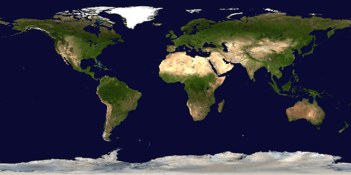

 
## Where In the World Is the International Space Station (ISS)?

### Objectives
- Use the `requests` package to query real-world data
- Improve skills with dictionaries and indexing
- Learn about Python's built-in [turtle](https://docs.python.org/3.3/library/turtle.html?highlight=turtle) graphics library

### Part A
Using [this public API](http://api.open-notify.org/astros.json), write a Python program to obtain a list of the astronauts who are currently in space. Print their full names, the spacecraft they are currently on board, and the total number of astronauts in space.

### Part B
Using [**this** public API](http://api.open-notify.org/iss-now.json), obtain the current geographic coordinates (lat/lon) of the space station, along with a timestamp.

### Part C
With the [turtle](https://docs.python.org/3/library/turtle.html) graphics library (part of Python's standard library), create a graphics screen with the world map background image, [map.gif](./map.gif). Use `turtle` methods such as `Screen()`, `setup()`, `bgpic()`, and `setworldcoordinates()`. Register an icon image for the ISS within the turtle screen context, and create a `turtle.Turtle()` to move the ISS to its current lat/lon on the map. Use methods such as `shape()`, `setheading()`, `penup()`, and `goto()`.

### Part D
Find out the next time that the ISS will be overhead of Indianapolis, Indiana. Use the geographic lat/lon of Indianapolis, Indiana to plot a yellow dot on the map. Use [this public API](http://api.open-notify.org/iss-pass.json) to query the next pass.

You will need to supply the lat/lon coordinates as query parameters to this URL. The passover times are returned as timestamps, so you will need to use the `time.ctime()` method to convert them to human-readable text. Render the next passover time next to the Indianapolis location dot that you plotted earlier.

## Testing
Make sure you are rendering the ISS at the correct geo-coordinates.  Check your solution against NASA's [real-time ISS location tracker](https://spotthestation.nasa.gov/tracking_map.cfm).  If your position looks odd, you may be reversing the meaning of your lat/lon when using the `Turtle.goto()` function.  `Turtle.goto()` expects to receive an x,y coordinate pair.  Remember that longitudes are x, and latitudes are y.

## Submitting your work
To submit your solution for grading, you will need to create a github [Pull Request (PR)](https://docs.github.com/en/github/collaborating-with-issues-and-pull-requests/about-pull-requests).  Refer to the `PR Workflow` article in your course content for details.
