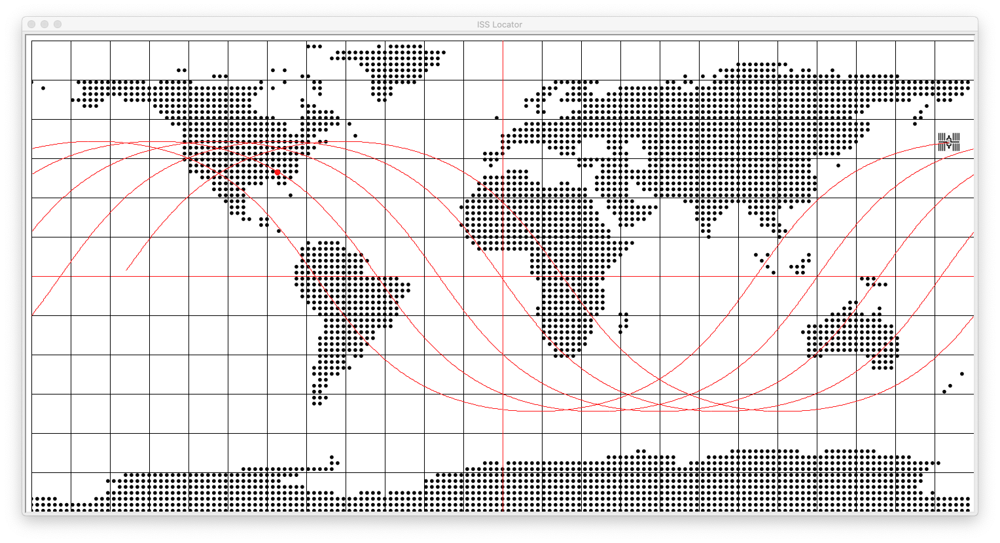

# Python ISS Locator #
This GUI application displays the current geocoordinates of the International Space Station (ISS), and primarily acts as an interface for the [Open Notify APIs](http://open-notify.org/). The application makes use of the python standard library module [`turtle`](https://docs.python.org/3/library/turtle.html), for the interface, and the [`requests`](https://requests.readthedocs.io/en/master/) module, for making HTTP GET requests.

### Requirements ###
+ **`tkinter` must be enabled on your python installation in order to properly display the interface.**
+ **If not already installed, `requests` must be installed via `pip -m install requests`**

## Interface ##
Although the application has a GUI, response dialogues occur through the command-line from which the program was run (`python iss.py`).
1. The red pin on the map denotes the user's current location (based on IP). Clicking it will display the ISS next pass information
2. The ISS displays its current location on the map. Clicking it will display it's information: location, passengers, etc.

## Requests ##
The application requests the user's location via [this API](https://ipinfo.io/) at runtime in order to get next pass information via [this API](http://open-notify.org/Open-Notify-API/ISS-Pass-Times/). In addition, [this API](http://open-notify.org/Open-Notify-API/ISS-Location-Now/) is periodically queried per five seconds in order to update the ISS turtle and trace a path on the map. The informational dialogue for the ISS also displays a list of astronauts aboard via [this API](http://open-notify.org/Open-Notify-API/People-In-Space/). If available, when queried the ISS will attempt to get the current locality it's above via [this API](https://developers.google.com/maps/documentation/geocoding/overview) (Unimplemented).

## Implementation ##
Under the hood, the implementation is primarily object-oriented. Two singleton objects: `SpaceStation` and `Window` work together to build the interface. The functionality of `SpaceStation` is supported by its primary methods: `get_info()`, `get_next_pass()`, `set_coords()`, and `init_updater()` and uses its attributes to share information between methods. Likewise, `Window` with its primary methods: `draw_line()` and `draw_grid()`.